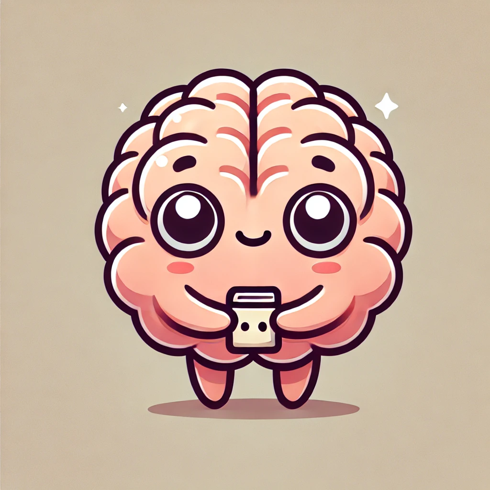

# Brainy
Brainy isn't too smart yet

  

# MoE Brainy
Converting Brainy to a Mixture of Experts model introduced a lot of unexpected twists and turns.

Brainy is a neural network that reads images of hand-written digits, and outputs a prediction of what digit the image is.

## How a MoE Model works
The basic idea of a Mixture of Experts (MoE) model is to train a set of disconnected 'expert' networks on your data. The hope is that each expert will learn to specialize in some aspect (or aspects) of the problem.

Once your experts are trained, you select only the experts with the requisite 'expertise' needed to handle the current input. This can allow you to reduce computation during inference, since instead of doing your calculations on ALL the numbers in all the experts, you only do calculations with the subset of numbers in the experts that are best suited for each specific input.

## One Digit Per Expert
At first, my idea was to train each expert on a specific digit. This would mean creating 10 expert networks and training each expert on hand-written digit images of only one number. I.e.: expert 0 would train on only 0s. Expert 1 would train only on 1s, etc...

However, there are 4 fatal flaws with this approach. Understanding the 4 fatal flaw requires understanding how a specific subset of experts are chosen for each input image. In other words, when a user draws a digit, how do we choose the subset of experts to process that input in order to generate a prediction of what digit the image is?

> A Quick Note on Training vs Inference
>
> A neural network is a big network of numbers that you add subtract and multiply with the hope that -- at the end -- you get a resulting number that represents a correct prediction for whatever problem you're trying to solve. For an LLM, the prediction is the correct next word in a sentence. In the case of Brainy, this is just a correct prediction of what hand-written digit a particular image is.
>
> During **Training**, you feed your example images into the network. Its important to note that each image Brainy uses is 'labelled' -- meaning that each image is paired with the a correct answer (this is called "Supervised Learning"). After the image is fed in (say, a hand-written "0"), we can then check whether Brainy made the correct prediction. If Brainy is wrong (e.g.: it thought a "0" was a "1"), we make a determination of *how wrong* it was, and then use techniques to adjust Brainy's network of numbers (based on how wrong Brainy was) so that it will do better the next time. This is a delicate process, because we don't want to adjust Brainy's parameters in a way that cause it to predict hand-written 0's better, but make it predict hand-written 1's worse. It must be done in a way that makes ALL predictions better. This "holistic" update technique is called "gradient descent", and its how the network "learns" to make better predictions overall.
>
> The key point to understand about training, is that -- during training -- we are still updating the parameters of the network.
>
> During **Inference** we are no longer updating the model parameters, even though -- like training -- we are feeding images through the network and making predictions.

## How Experts Are Chosen
As mentioned, a main benefit of using a MoE model is to only have to use a subset of your network to process any given input, and therefore save a lot of computation (and cost). You do this by selecting and activating only the experts best suited to the input at hand, and leave the others dormant.

But how do you know which experts to choose? Well, maybe you can run all the experts and choose the most confident experts? (i.e.: choose the experts that have a very large dominant probability for a single digit vs the experts that seem 'undecided' with a bunch of probabilities for multiple digits that are close to each other). But this defeats the purpose of saving computation, since it requires that you run them all.

### Stiiiiir the pile!
The way it is done in practice is to introduce a new network to the model called a **"Gating Network"**. The gating network's job is to choose which experts should handle a specific input. The important thing to know about the gating network is that it's decisions are **learned** -- just like the experts' parameters are learned. This means, we throw the gating network's parameters onto the same pile of numbers as the expert networks' parameters when doing gradient desecent.

  

Now, we can run the gating network first, get its decision on which experts to use, and run only the top experts (according to the gating network's reccomendation).

# The Problems with One Expert Per Digit
Having each expert specialize in learning to recognize a single digit seemed like the obvious direction for me to go at first. It didn't work out like that -- theoretically at least.

## A world of only 1s
The first problem is that -- for exmple -- while expert 1 would learn what a 1 is, it would never learn what a 1 is NOT. This same issue would occur for all the experts with respect to the one digit whose data they trained on.

## The Gating Network does all the real work
Another big problem also presented itself right away. Recall that the gating network chooses which experts to use. Since each expert specializes in a single digit, we have -- to a large extent -- moved the task of digit recognition from the experts to the gating network! In fact, if we set k = 1 (i.e.: the gating network selects a single expert), this is exactly the situation we end up with -- there is no need to have experts at all!

For example: If the gating network chooses expert 1, and expert 1 only recognizes 1s... why do we need expert 1? The fact that an expert that only recognizes 1s was selected is equivalent to a prediction of 1 for the current image.

> NOTE: I will need to actually test this to be sure if having 1 expert per digit actually does perform worst than allowing the experts more freedom to learn a specialization. However, I would be very surprised if a system where the gating network actually does most of the work were as good as a system that was able to utilize the experts.

## Presupposing how to specialize
But even if we set k to 3 or 6... it still highlights the fact that we seem to now be trying to 'hand code' something that the neural network she be *learning*. We are presupposing what the experts should specialize in. We are presupposing that the best way to recognize digits is to specialize in one digit, not specialize in more general aspects of digits (such as recognizing curves, straight segments, etc...).

## Defeats the purpose of Deep Learning
This also kind of goes against the very idea of deep learning. In the early days of Machine Learning, it was the job of humans to try and figure out the "features" that a network should try to learn in order to solve some higher order recognition problem. The job of determining what features were relevant to a recognition problem was call "Feature Engineering".

Deep Learning was developed as a way to make the discovery of the features themselves a part of the learning process. While one might correctly say that "the network still has to learn the features of each digit", we are still restricting what features each expert could possibly learn by restricting the data they see to examples of hand written images of one digit. Instead, we should leave it to the model to determine how the expertise required to solve this problem should be distributed amongst the experts.

# Top K Conundrum
Questions of how to utilize the top k experts during training and inference was more complex than I assumed.

## All the Experts
After this realization, I decided that the best way to train the experts was to expose all of them to all of the data.

Instead of 10 experts, I decided on 6 (my reasoning for 6 was based loosely on the structure of convolutional neural networks (CNNs) -- the state of the art in image recognition). Whether 6 is a good choice for the number of experts remains to be seen.

I will need to test with different values, but I will also take into account that one of the goals of Brainy MoE is to save computation cost -- so I focus on experimenting with low numbers of experts (likely no more than 10).

#### Training
So during training, we

1. run the gating network
2. activate ALL the experts
3. use the gating distribution to weight the outputs of the experts
4. sum the weighted probabilities for each digit
5. choose the "prediction" to be the digit with the highest weighted sum
6. calculate the loss (prediction versus ground truth)
7. perform gradient descent on all network weights

#### Inference
However, during inference, I would only use the top k experts (based on the gating network).

So to be clear: During training, all expert networks contribute to the prediction. However, during inference, only the top k experts contribute.

## Helicopter Parenting or Tough Love? 
However, this led to another problem:

- If we train the experts with exposure to all the digit images (not just for a single digit)...
- ...but during inference we only select the top k experts...
- ...how do we know we are not exlcuding experts that were fundamental in recognizing digits?

The reason why we worry about this is that **the model learned to recognize digits using ALL the experts**. However, to save compute cost during inference, we have hamstrung it to only use the top k.

Wouldn't it make more sense to have the model learn to recognize digits using only the top k experts right from the start?... since in "the real world" (inference time) it won't be able to rely on all the experts.

This is kind of like a parenting argument... If you provide too much help for your kids when they're young, are you denying them the chance to learn how to take care of themselves when that level of assistance is not available?

> NOTE: I will need to test this out with a special version of Brainy MoE. Specifically, I will need to test using only the top k experts in training is better than training with all of them if you plan to do inference only with the top k. So as of now -- while seeming logically plausible -- is not known. Also -- even if it does prove to be true with Brainy MoE, that does not mean it would apply in general to all models utilizing MoE.

## Tough Love
Because of this, I THEN decided -- at first -- to use only the top k experts during both training and inference.

However, this also didn't seem quite right. This meant that -- especially at the start of training -- the model would only get the benefit of optimizing based on the top k experts chosen by the gating network. However -- at the start of training -- **the gating network knows NOTHING**. Its initial selection of "top k" experts is completely random! It may very well be choosing poor experts. I learned that this is a known phenomenon called "The Cold Start Problem", but it is not the only problem.

After some discussion with Claude, I learned of other problems with this approach as well. I've listed a few of these below.

- **Expert Stagnation (Matthew Effect)**: "The rich get richer" - experts that start slightly better continue improving while others stagnate.
- **Underdeveloped Specialization**: Some experts might not get enough diverse examples to develop meaningful specializations.
- **Expert Collapse**: The model might converge to using only a subset of available experts, effectively reducing model capacity.

# The Final Version
Well, not the final version, but the final version of MoE Brainy 1.0.0.

I've decided to take a simple approach that wll hopefully balance the previous two options (which I've re-summarized below)

Option 1: Helicopter Option - Train the network with the benefit of having all experts at its disposal, and then send it into the real world ill-prepared to make decisions with only the top k experts.

Option 2: Tough Love Option - Train it from the start with only k experts for each prediction, possibly depriving its experts of learning the best way to recognize digits.

## Option 3: Gradual Detachment
In Machine Learning, each time a model iterates through the entire training dataset during training, it is called an 'epoch'.

Version 2.0.0 of Brainy (Brainy MoE) will train Brainy with all 6 experts in the first epoch. In the second epoch with 5 experts. In the the third, with 4. However, 3 is as low as we go. For the following 3 epochs, Brainy will only have the ability to choose 3 experts per image during  training.

This will hopefully solve the Cold Start problem to an extent. And also, it will hopefully -- slowly allow Brainy to get used to only having 3 experts to consult per image when its alone by itself in the 'real world' of inference after its parameters have been frozen.
